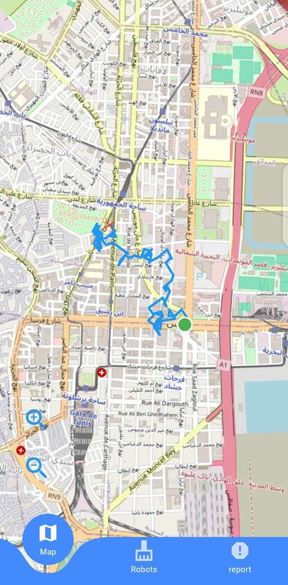
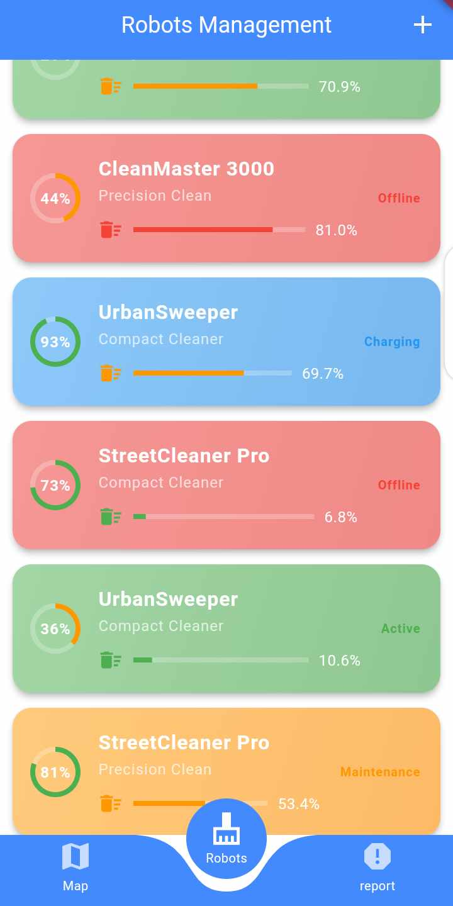
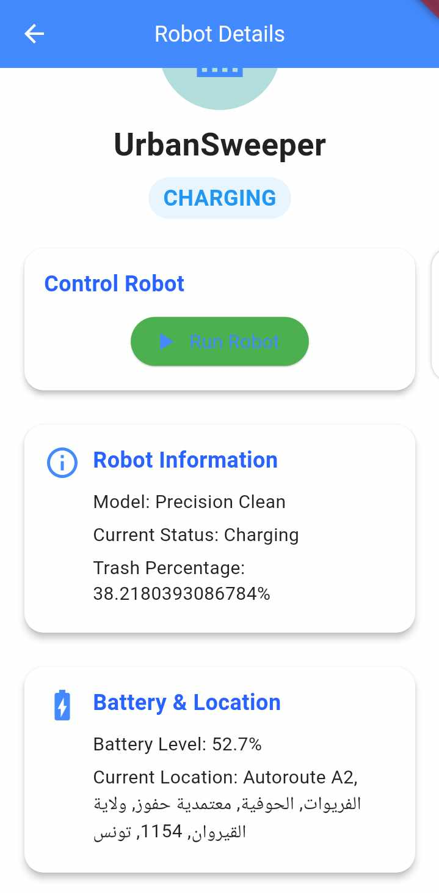
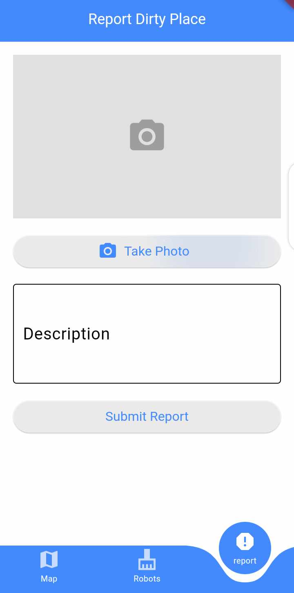

<a name="readme-top"></a>
<div align="center">

[![Contributors][contributors-shield]][contributors-url]
[![Forks][forks-shield]][forks-url]
[![Stargazers][stars-shield]][stars-url]
[![Issues][issues-shield]][issues-url]
[![MIT License][license-shield]][license-url]
</div>


<!-- PROJECT LOGO --> 
<br />
<div align="center">
    <h1 style="font-size:35px">Cleaner Tunisia Mobile App</h1>
    <br>
    <p style="font-size:20px" align="center">
        Climate Action through Robotics
        <br>
        TSYP12 RAS PES SIGHT challenge
    <br>
    <br>
    <a href="https://github.com/chater-marzougui/TSYP12-RAS-PES-SIGHT-challenge/issues/new?labels=bug&template=bug-report---.md">Report Bug</a>
    ·
    <a href="https://github.com/chater-marzougui/TSYP12-RAS-PES-SIGHT-challenge/issues/new?labels=enhancement&template=feature-request---.md">Request Feature</a>
  </p>
  <br>
  <a href="https://github.com/chater-marzougui/TSYP12-RAS-PES-SIGHT-challenge">
    
  </a>
</div>


# Cleaner Tunisia
<!-- TABLE OF CONTENTS -->
<details>
  <summary>Table of Contents</summary>
  <ol>
    <li><a href="#about-the-project">About The Project</a></li>
    <li><a href="#Project-Description">Description</a></li>
    <li><a href="#features">Features</a></li>
    <li><a href="#installation">Installation</a></li>
    <li><a href="#Usage">Usage</a></li>
    <li><a href="#license">License</a></li>
  </ol>
</details>


<!-- ABOUT THE PROJECT -->
## About The Project
Cleaner Tunisia is mobile app serves as an extension to the **Street Cleaning Robot** system, providing users with real-time insights and interactive control options for monitoring and directing street cleaning operations. Built with **Flutter**, this app offers features such as live map visualization and location reporting for cleaning.

## Project Description
The Street Cleaning Robot Mobile App streamlines the management of automated street cleaning operations. It allows users to track robot locations on a live map, monitor cleaned areas, report locations that need cleaning, and manually control the robots via MQTT protocol for precise adjustments. The app also provides key metrics such as battery status and capacity for effective scheduling and management. Built with Flutter for seamless cross-platform functionality, it leverages MQTT for real-time communication and OpenStreetMap for accurate robot movement and cleaning history visualization.

## Features
- **Real-Time Location Tracking**: View the robots current positions on a live map.
- **Cleaning Area Visualization**: See where the robots has already cleaned, indicated on the same map.
- **Report Location for Cleaning**: Users can mark specific locations that need to be cleaned, sending real-time requests for action.
- **MQTT-Controlled Interactivity**: Gain manual control of the robots through MQTT protocol, allowing for direct commands and adjustments as needed.
- **Robots Status Monitoring**: Check vital information about the robots, such as battery level and storage capacity, for efficient resource management and maintenance.

<br/>
<p align="right">(<a href="#readme-top">back to top</a>)</p>

## Installation

1. **Clone the Repository**:

```bash
git clone https://github.com/yourusername/street-cleaning-robot-app.git
cd street-cleaning-robot-app
```
2. **Install Dependencies: Run the following command to fetch all necessary Flutter dependencies:**

```bash
flutter pub get
```

3. **Run the App: To launch the app on an emulator or connected device, use:**
```bash
flutter run
```

<p align="right">(<a href="#readme-top">back to top</a>)</p>

## Usage

1. Tracking Robots Location: Upon opening the app, users can view the robots live locations on a OpenStreetMap interface, updated in real-time.
2. View Cleaned Areas: Areas that the robots has covered will appear highlighted on the map for easy reference.
3. Report a Location for Cleaning:
    - Tap on the "Report" button.
    - take a screanshot.
    - Submit the request, which will notify a robot operator of the location that needs to be cleaned.
4. Control the Robots via MQTT:
    - Navigate to the control interface within the app.
    - Use the directional controls or specific commands (e.g., Start/Stop Cleaning) to operate the robot.
    - Ensure an active connection to the MQTT server for seamless control.

<div style="display: flex; gap: 10px; text-align: center;">
    
    
    
    
</div>
<p align="right">(<a href="#readme-top">back to top</a>)</p>

## License

This project is licensed under the **MIT License** - see the [LICENSE](LICENSE) file for details.


<!-- MARKDOWN LINKS & IMAGES -->
<!-- https://www.markdownguide.org/basic-syntax/#reference-style-links -->
[contributors-shield]: https://img.shields.io/github/contributors/chater-marzougui/TSYP12-RAS-PES-SIGHT-challenge.svg?style=for-the-badge
[contributors-url]: https://github.com/chater-marzougui/TSYP12-RAS-PES-SIGHT-challenge/graphs/contributors
[forks-shield]: https://img.shields.io/github/forks/chater-marzougui/TSYP12-RAS-PES-SIGHT-challenge.svg?style=for-the-badge
[forks-url]: https://github.com/chater-marzougui/TSYP12-RAS-PES-SIGHT-challenge/network/members
[stars-shield]: https://img.shields.io/github/stars/chater-marzougui/TSYP12-RAS-PES-SIGHT-challenge.svg?style=for-the-badge
[stars-url]: https://github.com/chater-marzougui/TSYP12-RAS-PES-SIGHT-challenge/stargazers
[issues-shield]: https://img.shields.io/github/issues/chater-marzougui/TSYP12-RAS-PES-SIGHT-challenge.svg?style=for-the-badge
[issues-url]: https://github.com/chater-marzougui/TSYP12-RAS-PES-SIGHT-challenge/issues
[license-shield]: https://img.shields.io/github/license/chater-marzougui/TSYP12-RAS-PES-SIGHT-challenge.svg?style=for-the-badge
[license-url]: https://github.com/chater-marzougui/TSYP12-RAS-PES-SIGHT-challenge/blob/master/LICENSE.txt

